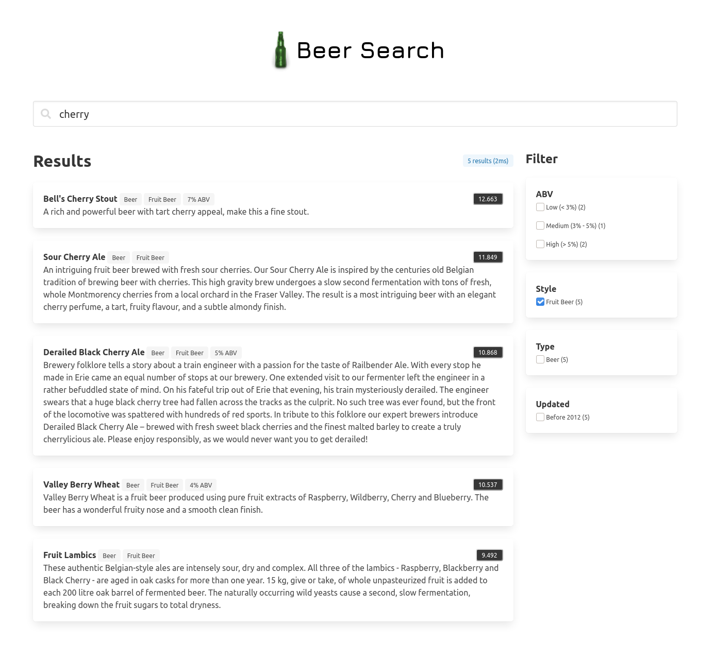

# beer-search

A sample application using Bluge to search beers and breweries.

### Usage

Normal use:

```
$ ./beer-search
2020/09/11 10:13:39 Listening on :8094
2020/09/11 10:13:39 Indexing...
2020/09/11 10:13:41 Indexed 7303 documents, in 1.699157624s (average 0.23ms/doc)
```

Demonstrate read-only access while main process is running.  In another terminal:

```
$ ./beer-search -testSearch           
  document match: 2208
  document match: 2206
  document match: 2211
  document match: 2202
  document match: 6437
```

Demonstrate backup while main application is still running.  In another terminal:

```
$ mkdir backups
$ ./beer-search -backupBeersTo backups
$ ls backups
00000000024c.seg  00000000024d.seg  00000000024e.seg  000000000395.snp 
```

### Screenshot



### License

Apache License Version 2.0